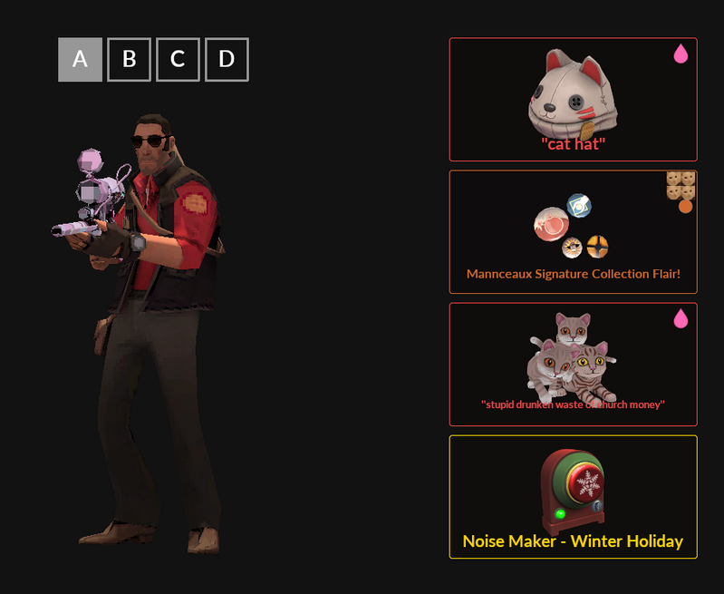

# No Hats Mod

This mod removes all of the hats and cosmetics in Team Fortress 2.

Works on windows and linux in both casual and community servers without preloading or any other tricks.

## Rationale
TF2 has an amazing art style that has been slowly ruined to the point [where](https://wiki.teamfortress.com/w/images/9/96/Filamental.png) [it](https://wiki.teamfortress.com/w/images/5/54/The_Monster_Mash-Up_Pack.png) [is](https://wiki.teamfortress.com/w/images/0/0f/Area_451.png) [not](https://wiki.teamfortress.com/w/images/f/f5/Potassium_Bonnett.png) [even](https://wiki.teamfortress.com/w/images/2/29/Dadliest_Catch.png) [funny](https://wiki.teamfortress.com/w/images/f/f3/Isolationist_Pack.png).

While this was made purely for aesthetic reasons and not for performance reasons you might gain some extra FPS while using this, no guarantees though.

## Downsides
* [Removes sniper backpacks](images/1.png) (spy players beware)
* Sometimes makes the pyros head invisible when they wear [certain cosmetics](images/2.png) (Just aim for where their head is supposed to be, you'll be grand)

## Preview


## Installing without building
Head to [here](https://github.com/dindybutts/no-hats-mod/releases/latest) and grab the latest release and then save it to your custom directory.

## Building
You need to have TF2 installed and then run the following commands.

```bash
sudo apt install python3 python3-pip make
git clone --depth 1 https://github.com/dindybutts/no-hats-mod
cd no-hats-mod
make
```

Then you can copy the vpk file here to your custom directory.

linux:
```
cp *.vpk $HOME/.steam/steam/steamapps/common/Team\ Fortress\ 2/tf/custom/
```

I'll keep this updated if valve ever decides to release a bunch of new hats again.

## Thanks to
* jeebsAU for the push to make my own mod once he stopped maintaining it
* https://github.com/ValvePython/vpk for the super nice tool to interact with vpk files (seriously it's a godsend compared to the one valve provides)
* Covid-19 for making me bored enough to make this

## Notes
While I'd **love** to be able to remove unusual effects and weapon skins it appears that you can't do this on casual servers (due to sv_pure 1) without using a preloading trick.
